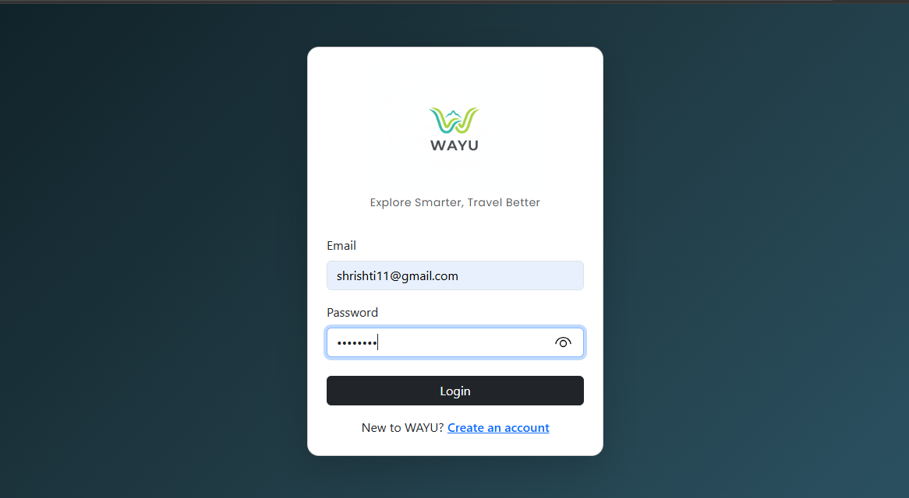
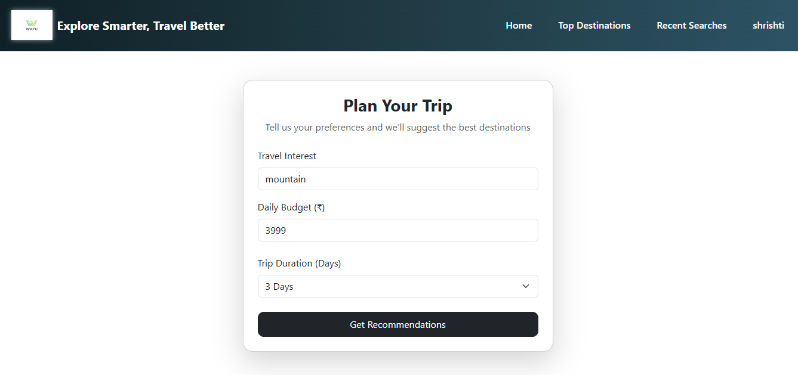
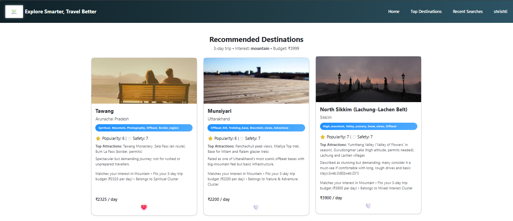
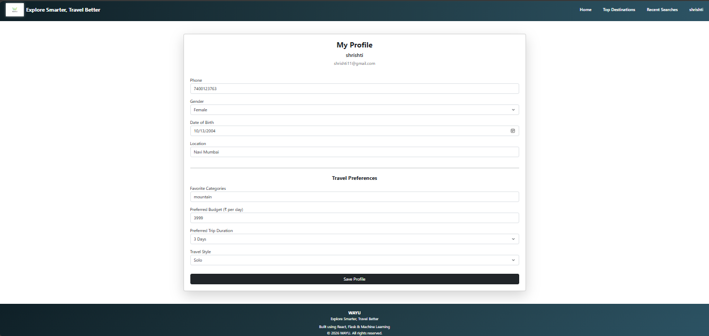
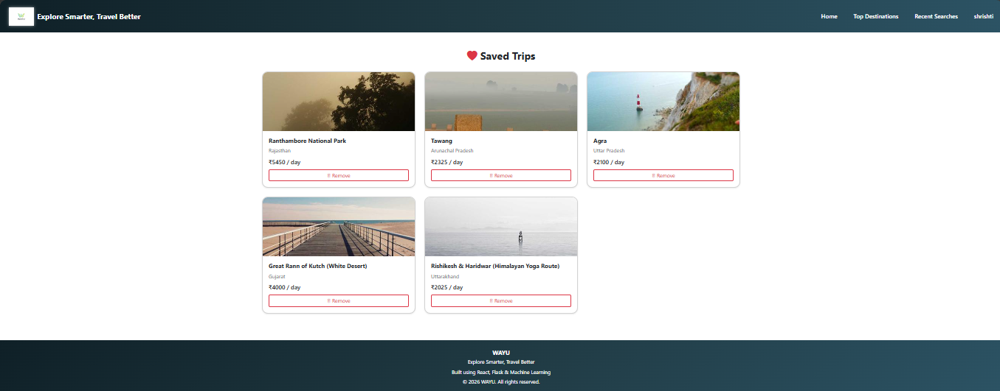
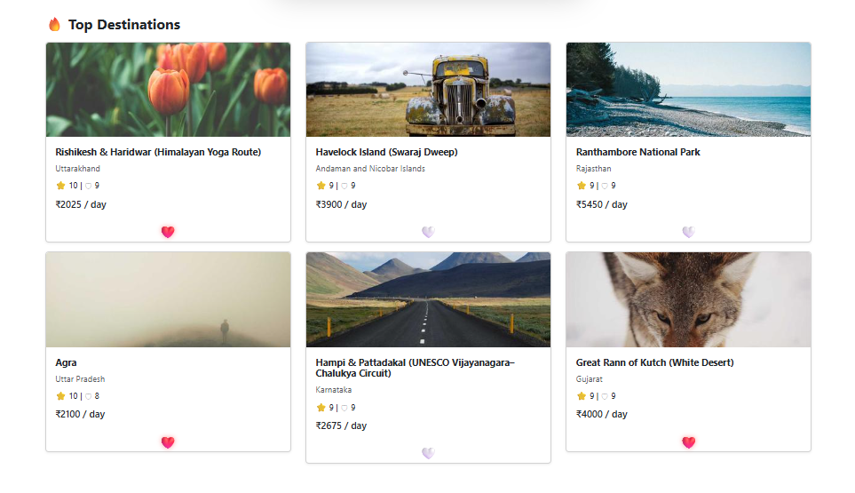

# WAYU – Smart Tourism Recommendation System

**Tagline:** *Explore Smarter, Travel Better*

WAYU is an AI-powered tourism recommendation platform that provides personalized travel suggestions based on user interests, budget, and trip duration. The system integrates Machine Learning with a modern full-stack web application to enhance travel planning and improve user experience.

## Features

### User Authentication
- User Registration and Login
- Secure password hashing using bcrypt
- MongoDB-based user management

### Smart Recommendation Engine
- Personalized destination recommendations
- Budget-based filtering
- Trip duration filtering
- Interest-based recommendations
- Explainable recommendations ("Why Recommended")

### Machine Learning Techniques
- TF-IDF Vectorization
- Cosine Similarity
- K-Means Clustering

### User Profile
- Store personal details
- Store travel preferences
- Auto-fill planner based on profile preferences

### Search History
- Stores recent searches
- MongoDB persistence
- Displays latest searches

### Saved Trips (Wishlist)
- Save favorite destinations
- Remove saved destinations
- Heart animation UI

### Popular Destinations
- Displays popular travel locations
- Shows popularity and safety ratings

### Modern UI/UX
- Responsive design
- Attractive recommendation cards
- Side navigation panel
- Interactive animations

## Tech Stack

### Frontend
- React.js
- Bootstrap
- CSS
- Bootstrap Icons

### Backend
- Flask
- Python

### Database
- MongoDB

### Machine Learning
- Scikit-learn
- TF-IDF
- Cosine Similarity
- K-Means Clustering
- Pandas

## Project Structure

```text
WAYU
├── backend
│   ├── data
│   ├── ml
│   ├── models
│   ├── routes
│   ├── app.py
│   └── requirements.txt
│
├── frontend
│   ├── public
│   ├── src
│   │   ├── components
│   │   ├── pages
│   │   ├── services
│   │   └── App.js
│   │
│   └── package.json
│
└── README.md
```

## Installation Guide

### Step 1: Clone Repository

```bash
git clone https://github.com/shrishti-v2/WAYU-Smart-Tourism-Recommendation-System.git
```

---

### Step 2: Navigate to Project

```bash
cd WAYU-Smart-Tourism-Recommendation-System
```

---

### Step 3: Backend Setup

```bash
cd backend

python -m venv venv

venv\Scripts\activate

pip install -r requirements.txt
```

Run backend:

```bash
python app.py
```

Backend runs on:

```bash
http://localhost:5000
```

---

### Step 4: Frontend Setup

Open new terminal:

```bash
cd frontend

npm install
```

Run frontend:

```bash
npm start
```

Frontend runs on:

```bash
http://localhost:3000
```

## How WAYU Works

1. User enters:
   - Interest
   - Budget
   - Trip duration

2. System processes:
   - Budget filtering
   - Preference matching
   - TF-IDF vectorization
   - Cosine similarity
   - K-Means clustering

3. System returns:
   - Personalized recommendations
   - Destination details
   - Popularity score
   - Safety score
   - Explanation for recommendation

## Screenshots

### Login Page


### Planner Page


### Recommendation Page


### Profile Page


### Saved Trips


### Top Destinations


## Future Scope

- Real-time weather API integration
- Hotel and flight booking integration
- Collaborative filtering
- Mobile application development
- Cloud deployment
- Real-time travel APIs

## Real-world Applications

- Tourism recommendation systems
- Travel booking platforms
- AI travel assistants
- Smart city tourism solutions

## Author

**Shrishti Vishwakarma**  
Final Year B.Sc Computer Science Student  
WAYU – Smart Tourism Recommendation System
